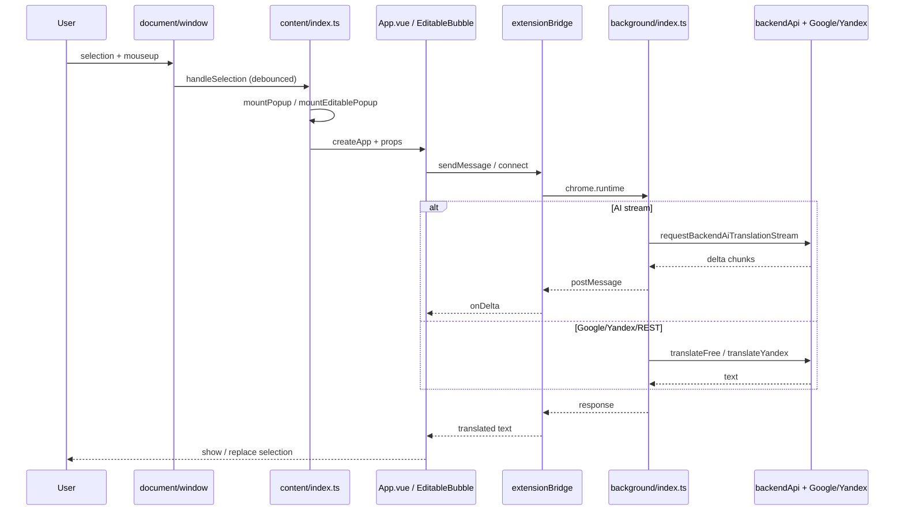

# Аудит Chrome-расширения Easy Translator

## 1. Костыли и сомнительная логика

**Где:** `src/content/index.ts:1062–1069`  
**Что:** На `contentWindow` вешается глобальный костыль `__translatorThemeBridgeAttached__` (`Record<string, unknown>`) и `IFRAME_SENTINEL` — это маркер «уже прослушиваем» плюс загрязнение namespace чужого `Window`.  
**Почему важно:** В теории коллизия с полем, которое страница/другой скрипт ожидает под таким же именем; нет типобезопасности.  
**Как лучше:** `WeakMap<Window, true>` в модуле content script (не виден странице) + явная сигнатура.

**Где:** `src/content/index.ts:1050–1056` (коммент + `void doc.body`)  
**Что:** Доступ к `doc.body` специально для срабатывания same-origin проверки Chrome.  
**Почему важно:** Классический «магический» side-effect, хрупко при смене поведения браузера.  
**Как лучше:** Оставить, но вынести в именованную функцию с одной строкой комментария в стиле «security probe».

**Где:** `src/content/index.ts:326–347` и `1089–1094`  
**Что:** Для позиции попапа используются **два** способа перевода координат из фрейма: `translateRectThroughFrame` (цепочка `frameElement` + `getBoundingClientRect`) в одном пути и в iframe-bridge — ручное `iframeRect.left + localRect...`.  
**Почему важно:** Дублирование и риск расхождения для вложенных/округлых iframe (редко, но дебаг сложный).  
**Как лучше:** Один хелпер `viewportRectFrom(iframe, localRect)`.

**Где:** `src/content/index.ts:187–192`, `src/App.vue:711–716`, `src/EditableTranslateBubble.vue:130–133`  
**Что:** Три копии `sanitizeProvider` с разными сигнатурами (`canUseAi` / `isAuthenticated` / `canUseAi`).  
**Почему важно:** Расхождение правил при рефакторинге.  
**Как лучше:** Один модуль `providerPolicy.ts` (или re-export из `translatorProtocol`).

**Где:** `src/background/index.ts:72–80` и `src/content/index.ts:187–192`  
**Что:** `normalizeTranslationMode` в service worker дублирует ту же бизнес-логику, что `sanitizeProvider` в content.  
**Почему важно:** Та же угроза рассинхрона, что и выше.  
**Как лучше:** Единая функция, импортируемая и в background (если допустим общий пакет без `window`).

**Где:** `src/services/reportBuffer.ts:30–68` и `src/services/sessionStore.ts:59–175` (и частично `src/content/powerToggle.ts:22–51`)  
**Что:** Повтор реализаций `hasSessionStorage` / get/set `chrome.storage.session` vs `local`.  
**Почему важно:** Копипаста, баги исправают в одном месте и забывают в другом.  
**Как лучше:** Слой `chromeStorage.ts` с одной реализацией.

**Где:** `src/content/index.ts:604–619`  
**Что:** `buildMainPopupProps` возвращает `Record<string, unknown>`, `initialAuthState` в контенте — `unknown`.  
**Почему важно:** Пропуск проверок на стыке content ↔ Vue: при несовпадении формата `authState` ошибки в рантайме.  
**Как лучше:** Типизированный объект пропсов + `satisfies` / явный `AuthState` после `loadInitialMainAuthState`.

**Где:** `src/services/googleTranslate.ts:72–90`  
**Что:** `parseArrayGtxResponse` приводит `data` к `unknown[]` и читает `root[0]` без `Array.isArray(data)`.  
**Почему важно:** Не-ответ-массив (строка, объект) ведёт к пустому переводу вместо явной ошибки.  
**Как лучше:** В начале `if (!Array.isArray(data))` fallback/ошибка.

**Где:** `src/background/index.ts:871` и `src/services/extensionBridge.ts:187`  
**Что:** `port.onMessage.addListener((message: any) =>` — `any` в стриме.  
**Почему важно:** Слабая дисциплина полей; ошибки всплывают позже.  
**Как лучше:** Discriminated union по `message.type` (как минимум для `start` / `delta` / `done` / `log` / `error` / `cancel`).

---

## 2. Неиспользуемый / мёртвый код

**Где:** `src/services/backendApi.ts:137–146` — `registerBackendUser`  
**Что:** Экспортируется, по проекту нет импортов; регистрация идёт через `registerInitBackend` + `registerVerifyBackend`.  
**Почему важно:** Мёртвый API и путаница, какой эндпоинт «каноничный».  
**Как лучше:** Удалить или задокументировать как «legacy/админ» и тогда оставить с пометкой.

**Где:** `src/services/googleTranslate.ts:133+` — `detectSourceLanguageFree`  
**Что:** Ни один файл в `src` не импортирует.  
**Почему важно:** Мёртвый экспорт в бандле (небольшой, но шум).  
**Как лучше:** Удалить либо подключить, если планировалось.

**Где:** `src/services/sessionStore.ts:220–226` — `loadInlineMode` / `saveInlineMode`  
**Что:** Тонкие обёртки над `loadInlineProvider` / `saveInlineProvider`; **нигде не вызываются** извне.  
**Почему важно:** Лишняя публичная поверхность.  
**Как лучше:** Удалить или оставить один публичный нейминг (только `*InlineProvider`).

**Где:** `src/services/extensionBridge.ts:317–335` — `translateViaAI` / `translateViaGoogle` / `translateViaYandex`  
**Что:** Все сводятся к `translateViaProvider`; **в `src` нет вызовов** этих трёх обёрток.  
**Почему важно:** Мёртвый публичный API.  
**Как лучше:** Удалить или оставить в `index` barrel только если внешние потребители есть.

**Где:** `src/services/validation.ts:1` — `export const EMAIL_REGEX`  
**Что:** Снаружи не импортируется; используется только внутри `isValidEmail`.  
**Почему важно:** Ненужный публичный экспорт.  
**Как лучше:** Убрать `export` с константы.

**Полный аудит неиспользуемых CSS-классов** в обёме папки `src/styles` без автоматического инструмента (PurgeCSS / анализ шаблонов) здесь **не** выполнялся — это отдельная задача.

---

## 3. Производительность и утечки

**Где (размер `content.js`):** `~222699` байт = `chrome-extension/build/content.js`; конфиг `vite.extension.config.js:35–50`  
**Что:** `inlineDynamicImports: true` для content — **один** чанк. В нём: Vue 3, полный `App.vue` (~1600 строк UI), `EditableTranslateBubble`, все сервисы по цепочке импорта, инлайн SCSS (`?inline` в `index.ts:27`), логика моста, `powerToggle` и т.д.  
**Почему важно:** ~223 KB в горячем пути content script; основная «масса» — Vue + приложение, не «пустой рантайм».  
**Как лучше:** `rollup-plugin-visualizer` на `EXT_BUILD_TARGET=content`; вынос редких панелей в lazy (если когда-либо split вернёте, осторожно с MV3 + dynamic import в content).

**Где:** `src/content/index.ts:1151–1165` — `MutationObserver` на `document.documentElement`  
**Что:** `observe` вызывается, **никогда** `disconnect()`.  
**Почему важно:** Для длинноживущей SPA (без ухода со страницы) наблюдатель живёт вечно; на типичных сайтах приемлемо, но при массовом DOM churn — фоновая стоимость.  
**Как лучше:** При `pagehide` без `persisted` — `iframeObserver.disconnect()` (симметрично `detachGlobalListeners`).

**Где:** `src/content/powerToggle.ts:266`  
**Что:** `window.addEventListener('resize', () => applyPosition...)` без `removeEventListener` при жизни страницы.  
**Почему важно:** Соответствует модели «расширение на всю сессию страницы»; утечка только при полном HMR/редких сценариях.  
**Как лучше:** Только если появится явный `destroy()` power toggle.

**Где:** `src/content/index.ts:664–684` и `804–830`  
**Что:** При каждом `mountPopup` / `mountEditablePopup` — асинхронные **`loadStoredSession` +** (по кластеру) `loadMainProvider` / `loadInlineProvider` / `loadResultSize` через `chrome.storage.local` / `get`.  
**Почему важно:** Это **горячий путь** «выделил текст → открылся попап»; задержка на I/O + несколько read подряд.  
**Как лучше:** Кэш сессии в переменной модуля с инвалидацией на `storage.onChanged` / после логина из попапа; батч одного `get` с несколькими ключами (у вас отдельные вызовы объединяются в `Promise.all`, но к backend storage всё равно несколько операций, если не схлопнуть в один `get`).

**Где:** `src/content/index.ts:194–213` — `onDocumentMouseMove` на `document` в режиме drag  
**Что:** Во время драга попапа — частые `mousemove` (нормально).  
**Почему важно:** Снятие слушателей через `removeDragListeners` в `attachDragListeners` — ок.

**Где:** `src/App.vue:1577–1610` — два `watch` с `immediate: true`  
**Что:** Завязка на то, что `targetLang` уже инициализирован `suggestTargetLangFromText`, а второй watch **не** дергает `runTranslate` при `prev === undefined` — иначе был бы дубль.  
**Почему важно:** Логика хрупкая: при будущем изменении инициализации легко получить **пропуск** или **двойной** `runTranslate`.  
**Как лучше:** Один `watch` с чётким `flush` / явной «первая загрузка» флаг-машина (или `watchEffect` с явными guard).

**Где:** `src/services/extensionBridge.ts:76–83`  
**Что:** `console.info('[translator-bridge] auth/status →', { ... })` на каждый `loadExtensionAuthState`.  
**Почему важно:** Шум в консоли и микростоимость на частых обновлениях auth.  
**Как лучше:** `debug` flag или `import.meta.env.DEV`.

---

## 4. Замена готовыми библиотеками (стоит ли?)

- **`@vueuse/core`** — `useEventListener` / `onClickOutside` частично перекрывают ручной add/remove в `App.vue` / `EditableTranslateBubble` (клик вне дропдауна). **Плюс:** единообразное снятие обработчиков. **Минус:** +десятки KB к бандлу (зависит от tree-shaking), при уже тяжёлом `content.js` сомнительно, если не вынести тяжёлый UI из content.
- **`mitt`** — нет централизованного event bus по коду; сообщения идут через `chrome.runtime` / props. **Не обязателен.**
- **`nanoid` / `uuid`** — в коде сессий/отчёта id генерятся иначе; **не видно** явной дыры, подключать ради одного id — избыточно.
- **Итог:** Имеет смысл **не** раздувать бандл ради мелких хелперов, пока не решена стратегия уменьшения content (отдельный offscreen/iframe, разделение чанков с осторогой к MV3).

---

## 5. Безопасность

**Где:** `src/services/sessionStore.ts:8, 164–175`, `src/background/index.ts:59–65, 189–224`  
**Что:** **Refresh-токен** в `chrome.storage.local` (`SESSION_STORAGE_KEY`), **access token** — в `chrome.storage.session` с явным открытием для `TRUSTED_AND_UNTRUSTED_CONTEXTS` (`background/index.ts:47–57`).  
**Почему важно:** Любой скрипт с доступом к **тому же** `chrome.storage.session` в контексте, которому открыли уровень, разделяет кэш. Комментарий в коде это признаёт; риск — в политике Chrome и в том, **кто ещё** получает `UNTRUSTED` доступ (намеренно для content/popup).  
**Как лучше:** Минимизировать время жизни access в session; не логировать токены (сейчас в логах — метаданные, не сами токены — хорошо).

**Где:** `src/services/requestSigning.ts:1–4, 26–40`  
**Что:** **Секрет HMAC** зашит в исходнике клиента (`CLIENT_HMAC_CURRENT_SECRET` — строка).  
**Почему важно:** Любой, кто скачал расширение, **воспроизводит** подпись; для сервера это не аутентификация «секретного клиента», а **обфускация** + rate-limit на стороне API.  
**Как лучше:** Понимать как защиту от **простого** курла без ключа, а не от злоумышленника; ротация секретов на стороне сервера, привязка к версии расширения, мониторинг аномалий.

**Где:** `v-html` в `src` — **не найден**; `innerHTML` — `src/content/powerToggle.ts:186`  
**Что:** `btn.innerHTML = GROK_SVG` — **константа** из того же модуля, не из сети/пользователя.  
**Почему важно:** XSS сценария «вставка перевода в DOM innerHTML» в этом месте **нет** (низкий риск).  
**Как лучше:** `createElementNS` / template literal `shadow` для параноидального стиля — опционально.

**Где:** `src/background/index.ts:801+` — `chrome.runtime.onMessage`  
**Что:** **Нет** проверки `sender.origin` веб-страницы — в Chrome API сообщения **от веб-страницы по умоланию идут через content script** (тот же extension id). Сторонние сайты **не** шлют произвольные `BackgroundRequest` без `externally_connectable` / вредоносного расширения.  
**Почему важно:** Модель угроз — другой компонент расширения с тем же `extension id` (редко) или баг в другом пути.  
**Как лучше:** Явно валидировать `message.type` (у вас `switch` — ок); при появлении `externally_connectable` — **обязателен** allowlist.

**Где:** `src/services/yandexTranslate.ts:17–26`  
**Что:** Подделка `Origin`/`Referer` под `youtube.com` для публичного API.  
**Почему важно:** Не уязвимость расширения, а **хрупкость** интеграции (Yandex может резать по политике/юридике).  
**Как лучше:** Мониторинг 403/пустых ответов, fallback (у вас в background уже есть ветки).

---

## 6. Типизация и корнер-кейсы

**Где:** `src/content/index.ts:1067`  
**Что:** `const winAny = win as unknown as Record<string, unknown>`.  
**Почему важно:** Скрывается несоответствие reality; в JS это ок, но **любой** ключ ок.  
**Как лучше:** `WeakMap` вместо поля на `window` (см. п.1).

**Где:** `src/App.vue:1069` — `function pick(opt)`  
**Что:** Неаннотированный параметр (в репо **нет** корневого `tsconfig` для фронта в проверенных файлах — строгая проверка может отсутствовать).  
**Почему важно:** `opt` в шаблоне — элемент списка языков; при опечатке в шаблоне возможны runtime-ошибки.  
**Как лучше:** `function pick(opt: { value: string; label: string })` (или тип из `languageOptions`).

**Где:** `src/App.vue:423–426` — `initialAuthState: { type: Object, default: undefined }`  
**Что:** Runtime props проверяются слабо; `aiState` строится из объекта.  
**Почему важно:** Некорректные поля от устаревшего storage → странное UI/ошибки в глубине.  
**Как лучше:** Zod/ручной guard при загрузке сессии в `loadStoredSession` (одна точка валидации).

**Где:** `src/EditableTranslateBubble.vue:152` — `let removeDocClick = null`  
**Что:** Не указан union `(() => void) | null`.  
**Почему важно:** В строгом TS — ошибка.  
**Как лучше:** Явный тип, как в `App.vue` для `removeDocClick`.

**Где:** `parseJsonSafe` в `src/services/backendApi.ts:75–83`  
**Что:** `JSON.parse(text) as T` — доверие к ответу сервера.  
**Почему важно:** Несоответствие ожидаемой форме — в рантайме дальше по коду.  
**Как лучше:** Валидация критичных полей (хотя бы `accessToken` string).

---

## 7. Архитектурная карта (поток выделения → перевод)

Кратко:

1. **Пользователь** отпускает мышь после выделения: `src/content/index.ts:921–964` — `handleSelection` (через `mouseup` на `window`, дебаунс `SELECTION_DEBOUNCE_MS`).

2. Ветвление: **input/textarea** / **contenteditable** → `mountEditablePopup` (инлайн `EditableTranslateBubble`); иначе **страница** → `mountPopup` (главный `App.vue` в shadow host).

3. `mountMainComponent` / `mountInlineComponent` создают **Vue** в `hostEl` с shadow DOM, прокидывают `translateViaProvider` / колбэки.

4. **Перевод:** `src/services/extensionBridge.ts` — `chrome.runtime.sendMessage` с типом `BackgroundRequest` (`translate/...`) или `connect` **stream** `ai-translation-stream`.

5. **Service worker** `src/background/index.ts` — `handleRequest` / `requestTranslation` / стрим: доступ к `accessToken` из кэша, вызовы `src/services/backendApi.ts` (Grok) или fallback `googleTranslate` / `yandexTranslate`.

6. **Ответ** возвращается в Vue → текст в UI; для инлайна — `replaceEditableSelection` (`src/content/index.ts:765–802`) в DOM страницы.

Mermaid:

---

**Итог:** Код в целом прозрачно документирован (iframe-bridge, bfcache, child-frame storage), но **дублирование** политики провайдера, **дублирование** storage-хелперов, **клиентский HMAC** как псевдосекрет, **тяжёлый монолитный** `content.js` и **несколько мёртвых экспортов** — главные зоны для приоритизации. Полный анализ неиспользуемого SCSS без инструмента здесь **не** делался.

