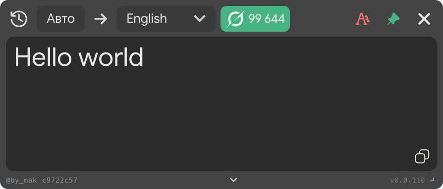

#  <a href="https://github.com/bymakk/">bymakk</a><a href="https://github.com/bymakk/easy_translator">/easy_translator</a>

Chrome-расширение: перевод выделенного текста на любой странице с поддержкой **Google**, **Yandex** и AI-перевода (**Grok**).  
Google и Yandex доступны **без регистрации**. С аккаунтом — Grok и автоматический откат на Google при нехватке токенов.

> [!CAUTION]
>
> ### © Авторские права
> Easy Translator — **проприетарное программное обеспечение**. Копирование, форки, создание производных продуктов и коммерческое использование **запрещены** без письменного разрешения автора. Подробнее: [LICENSE](./LICENSE).

> [!IMPORTANT]
>
> ### Источник сборки
> Считайте доверенной только копию из этого репозитория: **[bymakk/easy_translator](https://github.com/bymakk/easy_translator)**.  
> Сторонние репаки могут содержать изменённый код — проверяйте, что устанавливаете.

## ✨ Возможности

- **Перевод выделенного текста** — выделите любой фрагмент на странице, всплывающее окно покажет перевод
- **Замена текста в полях ввода** — маленький попап переводит и вставляет перевод прямо в поле
- **Google Translate** — без регистрации, бесплатно
- **Yandex Translate** — без регистрации, альтернативный движок в один клик
- **AI-перевод (Grok)** — с аккаунтом, точнее для сложных и разговорных текстов
- **Автопереключение** — при нехватке AI-токенов автоматически использует Google Translate
- **Закрепление окна** — два режима: фиксированное в экране (жёлтый) или следующее за страницей (зелёный)
- **Перетаскивание** — закреплённое окно можно перемещать
- **Выбор языка** — более 100 языков с поиском
- **Копирование перевода** — одним кликом
- **История переводов** — панель с последними переводами, иконкой провайдера, временем и токенами; копирование в один клик
- **Плавающая кнопка вкл/выкл** — круглая 50×50 иконка Grok в углу экрана: клик отключает/включает переводчик целиком, перетаскиванием можно перенести в любое место (позиция сохраняется)
- **Swap языков** — `Shift + Enter` меняет направление перевода (например `EN → RU` ↔ `RU → EN`)
- **Проверка обновлений** — показывает, если доступна новая версия

## ⚙️ Установка

Готовый билд берём со страницы **[Releases](https://github.com/bymakk/easy_translator/releases/latest)** — файл `easy_translator_vX.X.XX.zip`. Дальше на выбор любой из двух способов.

### Способ 1 — перетащить архив (без распаковки)

1. Скачайте архив `easy_translator_vX.X.XX.zip`.
2. Откройте в браузере страницу расширений: **`chrome://extensions`**.
3. Включите в правом верхнем углу **«Режим разработчика»**.
4. Перетащите скачанный `.zip` прямо в окно `chrome://extensions` — расширение установится автоматически.

### Способ 2 — через «Загрузить распакованное расширение»

1. Скачайте архив `easy_translator_vX.X.XX.zip`.
2. Распакуйте его в удобную папку, например `~/Downloads/easy_translator`. После распаковки в этой папке должны лежать файлы `manifest.json`, `content.js`, `background.js`, `options.html` и папка `assets/` — **никакой вложенной подпапки `build/` или `easy_translator_vX.X.XX/` в архиве нет**.
3. Откройте **`chrome://extensions`** и включите **«Режим разработчика»**.
4. Нажмите **«Загрузить распакованное расширение»** и выберите **именно ту папку, куда распаковали архив** (в которой лежит `manifest.json` в корне) — например `~/Downloads/easy_translator`. Не нужно заходить внутрь вложенных папок: если вы видите `manifest.json` в текущей папке — это правильная папка.

После любого из способов значок расширения появится на панели инструментов, а в правом нижнем углу страниц — плавающая круглая кнопка Grok (её можно перетащить; клик выключает/включает переводчик).

**Альтернатива — исходная сборка из репозитория:** скачайте **Code → Download ZIP** ([прямая ссылка](https://github.com/bymakk/easy_translator/archive/refs/heads/main.zip)), распакуйте и в `chrome://extensions` выберите папку **`chrome-extension/build`** внутри распакованного репозитория.

## 🔄 Обновление

1. Скачайте свежий релизный ZIP со страницы **[Releases](https://github.com/bymakk/easy_translator/releases/latest)** и распакуйте поверх старого.
2. Откройте **`chrome://extensions`** и нажмите **↺** рядом с расширением.

Либо используйте `git pull`, если клонировали репозиторий.

## 🔐 Безопасность и обмен данными

Если вы **не используете режим Grok** (по умолчанию расширение работает через Google, опционально — Yandex), то **никакой регистрации, аккаунта и нашего бэкенда не требуется**, и ни один запрос не идёт на серверы автора. Обмен данными сводится к минимуму:

| Режим | Куда уходит выделенный текст | Что ещё передаётся |
|-------|------------------------------|---------------------|
| 🔵 **Google** (по умолчанию) | Напрямую на `translate.googleapis.com` (неофициальный endpoint с `client=gtx`, тот же, что используют простые клиенты перевода) | Только текст и пара «язык источника → язык цели». Никаких cookies аккаунта Google, никаких заголовков авторизации, никаких идентификаторов расширения. |
| 🔴 **Yandex** | Напрямую на `browser.translate.yandex.net` (публичный endpoint мобильного словаря) | То же: текст + языки. Без логина и cookies. |
| 🤖 **Grok (AI)** | Сначала на наш бэкенд `ai.translate.obfsn.ru`, затем из бэкенда в xAI Grok. Только в этом режиме нужен аккаунт и списываются токены. | Текст перевода, языки, ваш токен сессии. Без Grok-режима этот endpoint вообще не вызывается. |

Дополнительно, независимо от режима, раз в запуск расширение проверяет наличие новой версии через `api.github.com/repos/bymakk/easy_translator/releases/latest` — уходит только HTTP-запрос (user-agent браузера), ничего о выделенном тексте.

**Что остаётся локально, в `chrome.storage.local`:**

- последние переводы для панели истории (максимум 100 записей, только у вас в браузере);
- выбранный язык перевода, режим (Google / Yandex / AI), позиция и состояние плавающей кнопки;
- сессия аккаунта — **только если вы вошли в режим Grok**.

Никакой телеметрии, аналитики, сторонних трекеров и рекламных скриптов расширение не подгружает — все host_permissions в `manifest.json` перечислены явно и ограничены четырьмя доменами выше.

## 🤖 AI-перевод (Grok)

По умолчанию расширение использует бесплатный Google Translate. Для AI-перевода:

1. Нажмите на стрелку в нижней части попапа переводчика.
2. Зарегистрируйтесь или войдите в аккаунт.
3. Переключите режим перевода на **AI** (иконка в правом верхнем углу попапа).

> Используется модель **`grok-4.20-0309`**. При нехватке токенов расширение автоматически переключается на Google Translate.

### 💳 Стоимость и сколько переводов это даёт

AI-режим — **полностью по желанию**. Google и Yandex остаются бесплатными и работают без аккаунта. Grok подключается только если вам нужен заметно более качественный перевод: он правильно справляется с идиомами, сленгом, переносным значением и разговорной речью — там, где Google и Yandex часто отвечают буквальным подстрочником (см. таблицу сравнений ниже).

**Тариф:** `1 ₽ за 1000 токенов`. Пополнение — шагом по **100 000 токенов (= 100 ₽)**.

**Минимум за один перевод — 300 токенов (≈ 0.30 ₽).** Такой минимум нужен потому, что каждый запрос к Grok включает не только сам текст, но и системный промпт плюс набор примеров, которые заставляют модель отвечать в нужном стиле и справляться со сленгом, идиомами и матом.

**Что получается за 100 ₽ (= 100 000 токенов):**

| Характер использования | Средняя цена за перевод | Примерное число переводов за 100 ₽ |
|------------------------|-------------------------|--------------------------------------|
| Отдельные слова и короткие фразы (до ~5–10 слов) | ~0.30 ₽ (минимум) | **~300–330** |
| Обычные предложения / короткие абзацы | ~0.40–0.60 ₽ | **~160–250** |
| Длинные абзацы, большие куски текста | ~1–2 ₽ | **~50–100** |

## 🔀 Google vs Yandex vs Grok

Реальные ответы API на одни и те же запросы (`en → ru`). Разница хорошо видна на идиомах, сленге и разговорных выражениях.

---

<table>
<thead>
<tr>
  <th align="left">Оригинал</th>
  <th align="center">🔵 Google Translate</th>
  <th align="center">🔴 Yandex Translate</th>
  <th align="center">🤖 Grok 4.20</th>
</tr>
</thead>
<tbody>

<tr>
  <td><em>"Break a leg at your presentation today!"</em> Идиома</td>
  <td align="center">Сломай ногу сегодня на презентации!</td>
  <td align="center">Ни с того ни с сего приходите на свою сегодняшнюю презентацию!</td>
  <td align="center">✅ Ни пуха ни пера на презентации сегодня!</td>
</tr>

<tr>
  <td><em>"no cap, that outfit goes hard fr"</em> Современный сленг</td>
  <td align="center">без кепки, этот наряд идет тяжело</td>
  <td align="center">без кепки этот наряд будет очень к лицу.</td>
  <td align="center">✅ без шуток, этот наряд просто бомба</td>
</tr>

<tr>
  <td><em>"He threw me under the bus in front of the whole team"</em> Разговорная идиома</td>
  <td align="center">Он бросил меня под автобус на глазах у всей команды</td>
  <td align="center">Он выставил меня напоказ на глазах у всей команды</td>
  <td align="center">✅ Он подставил меня перед всей командой</td>
</tr>

<tr>
  <td><em>"Don't ghost me after this, okay?"</em> Интернет-сленг</td>
  <td align="center">Не призраки меня после этого, ладно?</td>
  <td align="center">Не приходи ко мне после этого, ладно?</td>
  <td align="center">✅ Только не пропадай после этого, ладно?</td>
</tr>

<tr>
  <td><em>"That joke landed so well, he killed it up there"</em> Переносное значение</td>
  <td align="center">Эта шутка пришлась так хорошо, что он ее там наверху убил</td>
  <td align="center">Эта шутка так хорошо удалась, что он просто взорвал ее</td>
  <td align="center">✅ Шутка зашла отлично — он просто порвал зал</td>
</tr>

</tbody>
</table>

---

## 📌 Режимы закрепления

| Цвет | Режим | Поведение |
|------|-------|-----------|
| — | Не закреплено | Попап закрывается при клике в стороне |
| 🟡 Жёлтый | Fixed | Окно фиксировано на экране, не скроллится со страницей |
| 🟢 Зелёный | Scroll | Окно следует за страницей при прокрутке |

Закреплённое окно можно перетаскивать за его верхнюю часть.

## ☑️ Распространённые вопросы

### Перевод не появляется

Убедитесь, что расширение включено на странице `chrome://extensions`. Попробуйте перезагрузить страницу. Некоторые сайты блокируют контент-скрипты — в таком случае расширение работать не будет.

### AI-перевод не работает

Проверьте баланс токенов в панели аккаунта (стрелка внизу попапа). При нулевом балансе перевод автоматически идёт через Google Translate.

### Попап не появляется при выделении

Выделение должно быть **не менее 2 символов**. Убедитесь, что расширение не заблокировано на этом сайте.

### Нашли ошибку или хотите предложить улучшение

Создайте **[Issue](https://github.com/bymakk/easy_translator/issues)** в репозитории.

## ⭐ Поддержка

Поставьте :star: репозиторию **[bymakk/easy_translator](https://github.com/bymakk/easy_translator)**, если расширение оказалось полезным.
